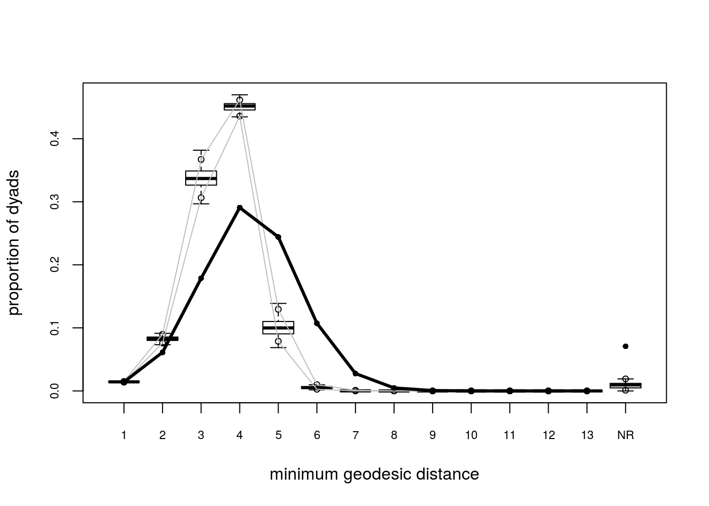

```{r setup, include=FALSE}
knitr::opts_chunk$set(echo = TRUE)
```

## Un poco de historia {style="font-size:65%"}

De @Hunter2006:

There has been a lot of work on models of the form (1.1), to which we refer as expo-
nential random graph models or ERGMs for short. (We avoid the lengthier EFRGM, for
“exponential family random graph models,” both for the sake of brevity and because we
consider some models in this article that should technically be called curved exponential
families.)

*   Holland and Leinhardt (1981) appear to be the first to propose a specific case of
model (1.1) in the literature. Their model, which they called the p1 model, resulted in each
dyad—by which we mean each pair of nodes—having edges independently of every other
dyad.

*   Based on developments in spatial statistics (Besag 1974), Frank and Strauss (1986)
generalized to the case in which dyads exhibit a kind of Markovian dependence: Two dyads
are dependent, conditional on the rest of the graph, only when they share a node.

*   Frank (1991) mentioned the application of model (1.1) to social networks in its full generality.

*   This was pursued by Wasserman and Pattison (1996). In honor of Holland and Leinhardt’s
p1 model, they referred to model (1.1) as p∗ (p-star), a name that has been widely applied
to ERGMs in the social networks literature.


## Exponential Random Graph Models (ERGMs)

Modelos Exponenciales para Grafos Aleatorios

*   ¿Qué conjunto de sub-estructuras dan origen al grafo observado?

*   Por ejemplo: \# de triadas, \# de diadas homofílicas, \# de k-estrellas, etc.

*   En este caso, $\mathbf{Y} = \mathbf{G}$

*   En general, la distribución de $\mathbf{Y}$ puede ser paremetrizada como sigue:
    
    $$
    \Pr\left(\mathbf{Y}=\mathbf{y}|\theta, \mathcal{Y}\right) = \frac{\exp{\theta^{\mbox{T}}\mathbf{g}(\mathbf{y})}}{\kappa\left(\theta, \mathcal{Y}\right)},\quad\mathbf{y}\in\mathcal{Y}
    \tag{1}
    $$
    
    Donde $\theta\in\Omega\subset\mathbb{R}^q$ es el vactor de coeficientes, y 
    $\mathbf{g}(\mathbf{y})$ es un *q*-vector de estadísticos basados en el
    grafo $\mathbf{y}$.

##

{style="width:800px;"}

---

*   Conceptualmente, decimos que la interdependencia de los lazos (*Markov dependence*)
    da origen a lo que denominamos *Markov Graphs* [@Frank1986] (de lo contrario
    los ERGMs no serían un problem).

*   El modelo (1) puede ser extendido para incluir covariables (*features*) 
    a nivel nodal o de lazo reemplazando $\mathbf{g}(\mathbf{y})$ por
    $\mathbf{g}(\mathbf{y}, \mathbf{X})$ 
    
*   El denominador,
    
    
    $$
    \kappa\left(\theta,\mathcal{Y}\right) = \sum_{\mathbf{z}\in\mathcal{Y}}\exp{\theta^{\mbox{T}}\mathbf{g}(\mathbf{z})}
    $$
    0
    
    Es la constante de normalización que asegura que (1) sea una funcion de probabilidad.

*   Aun restringiendo el conjunto $\mathcal{Y}$ a las redes de tamaño $n$,
    el número de elementos de $\mathcal{Y}$ hace la estimación de estos modelos
    difícil [@Hunter2008]. $N = 2^{n(n-1)}$
    
*   Una buena intro @ROBINS2007a; @ROBINS2007b.

## Separable Exponential Random Graph Models (a.k.a. TERGMs)

Los ERGMs Separables:

-   Modelos de tiempo discreto.

-   Estima un set de parametros $\theta = \{\theta^-, \theta^+\}$ que capturan
    las dinámicas de transición de $\mathbf{Y}^{t-1}$ a $\mathbf{Y}^{t}$.

-   Asumiendo que $(\mathbf{Y}^+\perp\mathbf{Y}^-) | \mathbf{Y}^{t-1}$ (el modelo
    dinámico es separable), se estima una probabilidad conjunta con las siguientes
    ecuaciones::
    $$
    \begin{align}
    \Pr\left(\mathbf{Y}^+ = \mathbf{y}^+|\mathbf{Y}^{t-1} = \mathbf{y}^{t-1};\theta^+\right),\quad \mathbf{y}^+\in\mathcal{Y}^+(\mathbf{y}^{t-1})\\
    \Pr\left(\mathbf{Y}^- = \mathbf{y}^-|\mathbf{Y}^{t-1} = \mathbf{y}^{t-1};\theta^-\right),\quad \mathbf{y}^-\in\mathcal{Y}^-(\mathbf{y}^{t-1})
    \end{align}
    $$

-   i.e. 2 ERGMs.

Más detalles en @Krivitsky2014.
    
## Latent Network Models

Los modelos de Redes Latentes (*Latent Networks*):

-   Las redes sociales son función de un espacio latente (no observado) $\mathbf{Z}$.

-   Individuos cercanos en $\mathbf{Z}$ tienen una probabilida mayor de
    estar conectados.

-   Además de estimar un set de parámetros $\theta$, la parte fundamental de este
    modelo es encontrar dicho espacio latente, $\mathbf{Z}$.

-   Similar a los TERGMs, bajo el supuesto de independencia condicional podemos
    estimar:

$$
\Pr\left(\mathbf{Y} =\mathbf{y}|\mathbf{X} = \mathbf{x}, \mathbf{Z}, \theta\right) = \prod_{i\neq j}\Pr\left(y_{ij}|z_i, z_j, x_{ij},\theta\right)
$$

Más detalles en  @hoff2002.

## ERGMs: Estimación

*   En el caso general, la estimación de esta familia de modelos no es factible
    utilizando enumeración exahustiva de los grafos.
    
*   Por ejemplo, si $n = 7$, entonces $\left|\mathcal{Y}\right| = 2^{7(7-1)} \approx 4.39\times10^{12}$

*   Varios métodos propuestos para resolver este problema: Algoritmo Robbins-Monro
    (*stochastic approximation*, @robbins1951), MCMC-MLE

*   Revisaremos el último

## {style="font-size: 80%"}

### MCMC-MLE

1.  Inicializar el algoritmo con un $\theta=\theta^{(t)}$,
    por lo general se utiliza *Maximum-Pseudo-Likelihood-Estimator* (MPLE) que
    equivale a una regresión logística.

2.  Mientras $\neg{}Converencia$ :
    
    a.  Utilizando $\theta^{(t)}$, simula $M$ redes modificando el grafo
        $\mathbf{Y}_{obs}$ lazo a lazo. Esta parte se realiza utilizando un algoritmo
        de *importance-sampling* donde la ponderación de cada grafo esta dada por
        la verosimilitud condicional en $\theta^{(t)}$
    
    b.  Con las redes simuladas, podemos realizar el paso *Newton* para actualizar
        $\theta^{(t)}$ (esta es la parte de iteración en el paquete `ergm`):
        $\theta^{(t)}\to\theta^{(t+1)}$
    
    c.  De haber alcanzado convergencia (Ej: la distancia entre $\theta^{(t)}$ y
        $\theta^{(t + 1)}$ es cercana a cero), detener, de lo contrario volver
        al paso a.

Para más detalles vea @lusher2012; @admiraal2006; @Snijders2002; @Wang2009
da detalles respecto del algoritmo utilizado en PNet (Robbins-Monro en `RSiena`).
@lusher2012 muestra de manera breve las diferencias entre `ergm` and `PNet`. 

## Problemas

<div align="center">
{style="width:500px"}
{style="width:500px"}

Example of problems encountered in the estimation process of ERGMs: No 
convergence (left), and model degeneracy (right). @handcock2003; @Schweinberger2015
for a discussion
</div>


## Redes pequeñas y ERGMs

Cuando intentamos estimar ERGMs en redes pequeñas: \pause

*   MCMC no converge al intentar estimar un modelo de tipo *block diagonal*
    (zeros estructurales),\pause

*   Lo mismo ocurre cuando intentamos estimar un ERGM para una red pequeña, \pause

*   ~~Even if it converges, the Asymptotic properties of MLEs are no longer valid
    since the sample size is not large enough.~~ (not true!)

    
## Repensando el problema

\pause

*   1st Step: Olvidemos el MCMC-MLE, aprovechemos el tamaño de la red para calcular
    la función de log-verosimilitud y apliquemos MLE: \pause
    
    $$
    \Pr\left(\mathbf{Y}=\mathbf{y}|\theta, \mathcal{Y}\right) = \frac{\exp{\theta^{\mbox{T}}\mathbf{g}(\mathbf{y})}}{\kappa\left(\theta, \mathcal{Y}\right)},\quad\mathbf{y}\in\mathcal{Y}
    $$
    
*   Esto resuelve el problam de *degenarcy* encontrado en ERGMs. \pause

*   Lo que ya esta implementado en el paquete `lergm`
    (disponible en https://github.com/USCCANA/lergm):\pause
    
    *   No desde 0: Utiliza algunas de las funciones ya incluidas en el paquete
        de statnet, `ergm`, en particular
        `ergm-terms`, `formula_ergm`.\pause
    
    *   De alto rendimiento (hasta un punto): Algunos de sus componentes están
        escritos en C++\pause
    
    *   Estapa experimental...\pause ~~we'll see if it is worth keep
        working on it!~~

## Ejemplo 1

Partamos por estimar un ERGM para una red con 4 nodos

```{r lergm1, echo=TRUE}
library(lergm)
set.seed(12)
x <- sna::rgraph(4)
lergm(x ~ edges + balance + mutual)
```

A esto le llamo ERGMito (Gracias a George Barnett en la conferencia NASN2018!)

## Pooled ERGMitos

*   Cuando estimamos el modelo de bloque diagonal, en cierta medida estamos asumiendo
    que las redes son idependientes.\pause

*   Esto implica que podemos hacer lo mismo con la función de verosimilitud, en
    otras palabras, la verosimilitud conjunta es el producto de las independientes:\pause
    
    $$
    \Pr\left(\mathbf{Y}=\{\mathbf{y}_{\color{cyan} i}\}|\theta, \left\{\mathcal{Y}_{\color{cyan}i}\right\}\right) = {\color{cyan} \prod_i} \frac{\exp{\theta^{\mbox{T}}\mathbf{g}(\mathbf{y}_{\color{cyan} i})}}{\kappa_{\color{cyan} i}\left(\theta, \mathcal{Y}_{\color{cyan}i}\right)}
    $$
    \pause
    
*   Estimando una version *pooled* del ERGMito aumentamos el poder de nuestro
    modelo.\pause
    
*   Esto también esta en el paquete `lergm`
    
## Ejemplo 2

Supon que tenemos 3 grafos pequeños de tamaño 4, 5, y 5 respectivamente:

```{r lergm2, echo=TRUE}
library(lergm)
set.seed(12)
x1 <- sna::rgraph(4)
x2 <- sna::rgraph(5)
x3 <- sna::rgraph(5)

lergm(list(x1, x2, x3) ~ edges + balance + mutual)
```

## Bibliografía {style="font-size:45%"}

