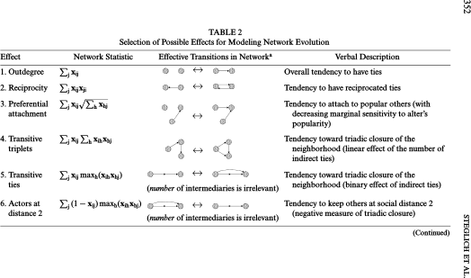
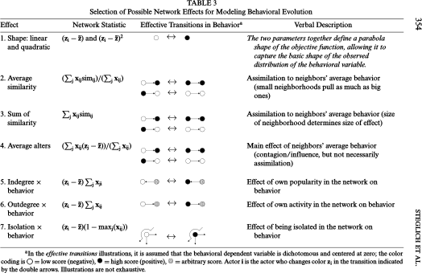
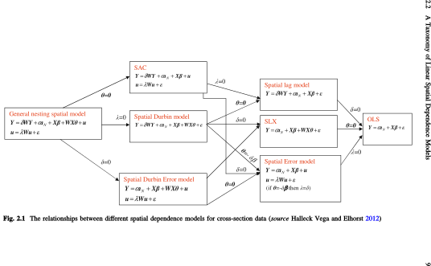
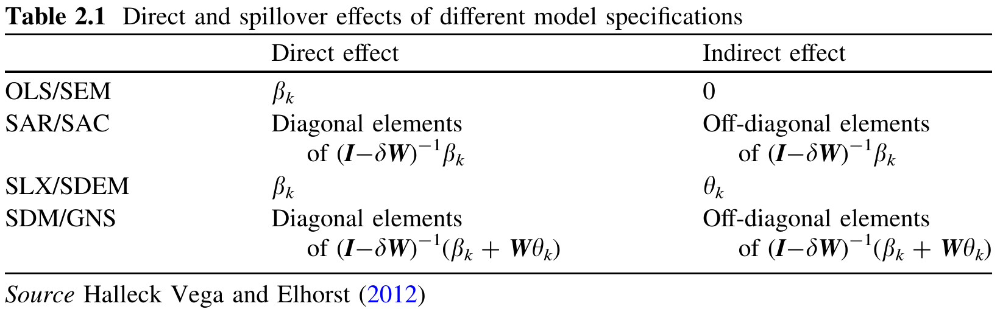

```{r setup, include=FALSE}
knitr::opts_chunk$set(echo = TRUE, warning = FALSE, message = FALSE)
library(Matrix)
```

Antes de partir... retomaremos un modelo que nos faltó revisar

## Stochastic Actor Oriented Models (SOAM, aka Siena)

Los modelos Siena:

*   Modelan la co-evolución de la red y el comportamiento.

*   A diferencia de los ERGMs (*cross-section*), Siena modela datos dinámicos. 
    Más aun, ponen el foco en el individuo.
    
*   El modelo asume que los cambios en la red o comportamiento ocurren de manera
    continua (no discreta)--como ocurre con un proceso poisson--y uno a la vez
    desde el punto de vista del individuo.
    
*   Estos corresponden a los denominados *micro-step*, y hacen que el modelamiento
    sea en general más sencillo (nos enfocamos en un cambio a la vez)
    
---

*   Dos funciones principales componen el modelo: $f_i^G(g) = s_{Gi}(g, y)\theta^G$,
    utilidad que el individuo $i$ obtiene con el estado del grafo $g$, y
    $f_i^Y(y) = s_{Yi}(g, y)\theta^Y$, utilidad que el mismo individuo obtiene
    con el estado de la variable $y$.
    
*   De manera similar a los ERGMs, las funciones objetivo son:
    
    $$
    \frac{\exp f_i^G(g)}{\sum_{g'\in\mathcal{G}}\exp f_i^G(g')}, \quad
    \frac{\exp f_i^Y(y)}{\sum_{y'\in\mathcal{Y}}\exp f_i^Y(y')}
    $$

Sección 5 *Model specification* de *Manual for RSiena* [@ripley2011] para ver
una descripción asociada a RSiena, y @Snijders2010; @Steglich2010 para una introducción más
detallada (no tan formal) del modelo.


---

{style="width:900px;"}

---

{style="width:900px;"}


## Autocorrelación

*   La I de Moran [@Moran1950]: Pregunta, ¿está la variable $X$ correlacionada a
    nivel espacial?
    
    $$
    I={\frac {N}{W}}{\frac {\sum _{i}\sum _{j}w_{ij}(x_{i}-{\bar {x}})(x_{j}-{\bar {x}})}{\sum _{i}(x_{i}-{\bar {x}})^{2}}}
    $$
    
    Donde $W$ es una matriz normalizada (*row-normalized*) 

## Autocorrelación (Moran -1)

```{r moran-ej-neg, warning=FALSE, echo=FALSE, fig.align='center', fig.cap="Ejemplo de I de Moran con valor cercano o igual a 1. La matriz fue graficada utilizando el metodo dgCMatrix de la funcion image."}
# Alta correlacion negativa
m <- as.matrix(expand.grid(1:5, 1:5))
m <- as.matrix(dist(m))
m[m >= sqrt(2)] <- 0
y <- matrix(c(0,1), nrow=5, ncol=5)
str(netdiffuseR::moran(y, m))
image(as(y, "dgCMatrix"))
```

## Autocorrelación (Moran cercano a 1)

```{r moran-ej-pos, warning=FALSE, echo=FALSE, fig.align='center', fig.cap="Ejemplo de I de Moran con valor cercano o igual a 1. La matriz fue graficada utilizando el metodo dgCMatrix de la funcion image."}
# Alta correlacion positiva
m <- as.matrix(expand.grid(1:4, 1:4))
m <- as.matrix(dist(m))
m[m >= sqrt(2)] <- 0
y <- matrix(c(1,1,0,0), nrow=4, ncol=4, byrow = TRUE)
str(netdiffuseR::moran(as.vector(y), m))
image(as(y, "dgCMatrix"))

```

## Autocorrelación (Moran cercano a 0)

```{r moran-ej-0, warning=FALSE, echo=FALSE, fig.align='center', fig.cap="Ejemplo de I de Moran con valor cercano o igual a 0. La matriz fue graficada utilizando el metodo dgCMatrix de la funcion image."}
# Correlacion cercana a 0
set.seed(1872)
m <- as.matrix(expand.grid(1:20, 1:20))
m <- as.matrix(dist(m))
m[m >= sqrt(2)] <- 0
y <- matrix(rbinom(400, size = 1, .5), nrow=20)
str(netdiffuseR::moran(as.vector(y), m))
image(as(y, "dgCMatrix"))
```


## Modelos de Autocorrelacion Espacial/*Spatial Autocorrelation Models* (SAR a.k.a. Network Auto-correlation Models) {.smaller}

Los modelos SAR:

*   Principalmente utilizados en el contexto de la estadística y la econometria espacial.
    
*   Una amplia gama de modelos. Es posible encontrar los SAR equivalentes a Probit, Logit, MLogit, etc.
    
*   A diferencia del típico modelo de regresión lineal, el modelo SAR tiene la 
    endogeneidad como parte de su especificación utilizando una distribución
    normal multivariada (MNV):
    
    $$
    \begin{align}
    Y = & \alpha + \rho W Y + X\beta + \varepsilon,\quad\varepsilon\sim MVN(0,\sigma^2I_n)
    \end{align}
    $$

    Donde $\rho\in[-1,1]$ and $W=\{w_{ij}\}$, with $\sum_j w_{ij} = 1$
    
*   Una intro buena es @LeSage2008

## Spatial Autocorrelation Models (SAR) (cont.) {.smaller}

*   Este tipo de modelos está más cerca de lo que parece, pues el $i$-ésimo 
    elemento de $Wy$ puede ser expresado como $\frac{\sum_j a_{ij} y_j}{\sum_j a_{ij}}$,
    que usualmente se denomina como "exposición" en la literatura de redes sociales,
    con $a_{ij}$ un elemento de la matriz adjacente.
    
*   Estos modelos asumen que $W$ es exógeno, en otras palabras, si es que tus
    datos presentan algo como homofilia, entonces este modelo estará sesgado.
    
*   Pero al igual que muchos otros en econometría, existen soluciones para problemas
    de endogeneida (variables instrumentales), he incluso estimadores de varianza
    robusta corrigiendo por heterocedasticidad [@Kelejian2010; @Piras2010].

## ¿Qué Matriz?

*   La pregunta "Cual de todas las posibles matrices debo utilizar" es más
    común de lo que debería, en particular:
    
    1.  Cuántos vecinos,
    2.  Qué forma funcional,
    3.  etc.
    
    En @LeSage2014 argumenta que en princiopio no es tan relevante.
    
*   Una propiedad importante e interesante es que $(I_n - \rho W)^{-1}$
    es que tiene una descomposición que implica que los efectos van más allá de
    los vecinos directos: $I_n + \rho W + \rho^2 W^2 + \dots$
    
## Resumen

{style="width:900px;"}

Fuente: @elhorst2013


## Efectos Marginales

{style="width:800px;"}

Fuente: @elhorst2013

## Ejemplo con datos simulados

*   Para simular un modelo SAR, podemos seguir los siguientes pasos:
    
    1.  Generar una matriz de covariables $X$ junto con sus respectivos coeficientes,
    
    2.  Generar un vector $\varepsilon \sim N(0,1)$, pregunta: ¿Importa no utilizar
        la función MVN (`mvtnorm::rmvnorm`)?
        
    3.  Generar el vector $Y$ de la siguiente forma: 
    
        $$
        Y = \left(I_n -\rho W\right)^{-1}(\alpha + X\beta + \varepsilon)
        $$
        
        Donde $I_n$ es una matriz diagonal $n$.
        
## Ejemplo con datos simulados (cont.)

Para más información sobre los objetos `nb` ver la sección *9.2 Spatial Neighbours*
del libro *Applied spatial data analysis with R* [@bivand2008].


```{r ejemplo1-dgp}
# Parametros para la simulacion
set.seed(1151)
n   <- 500L
k   <- 2L
rho <- .5

# Simulando covariables y coeficientes
X   <- matrix(runif(n*k), ncol=k)
b   <- cbind(runif(k + 1L, -1, 1))
eps <- cbind(rnorm(n))
```

---

```{r ejemplo1-red}
# Simulando matriz espacial, utilizaremos el paquete igraph para esto
library(igraph)
library(Matrix) # Para acceder al dgCMatrix en la funcion rowSums

# Modelo mundo pequeño parametros 8 (numero de vecinos) y .4 (probabilidad) de
# re-cableo.
net <- igraph::sample_smallworld(1, n, 8, .4)
W   <- as_adj(net)

# Normalizando matriz y visualizando
W   <- W/rowSums(W)
image(W)
```

---

```{r ejemplo1-estimacion-moran}
# Generando variable dependiente
Y <- as.matrix(solve(diag(n) - rho*W) %*% (cbind(1, X) %*% b + eps))

# La I de moran
netdiffuseR::moran(Y, W)

# OBS: La implentacion en netdiffuseR es significativamente mas rapida que la del
# paquete spdep (~ 100 veces en mi maquina).
# Wlist <- mat2listw(W)
# microbenchmark::microbenchmark(
#   netdiffuseR::moran(Y, W), # Para matrices realmente grandes
#   moran.test(Y, Wlist, alternative = "two.sided")  
# )
```

---

```{r ejemplo1-estimacion-omit}
library(spdep) # Para el test de moran
# Naive OLS
ans0 <- lm(Y ~ X)
lm.morantest(ans0, listw = mat2listw(W)) # netdiffuseR::moran(ans0$residuals, W)
```

---

```{r ejemplo1-estimacion-incluir}
# Modelos de regresion
WY <- as.matrix(W %*% Y)
ans1 <- lm(Y ~ WY + X) # Coeficiente sesgado
ans1
```

## {style="font-size:70%"}

```{r ejemplo1-estimacion-sar}
# Modelos SAR
library(spdep)
(ans2 <- lagsarlm(Y ~ X, listw = mat2listw(W))) # Especificacion correcta
(ans3 <- lagsarlm(Y ~ X, listw = mat2listw(W), Durbin = ~ X[,-1])) # Especificacion incorrecta
```

## {style="font-size:70%"}

```{r ejemplo1-tabla, results='asis'}
texreg::htmlreg(list(ans0, ans1, ans2, ans3), doctype = FALSE)
```

## Bibliografía {style="font-size:60%"}