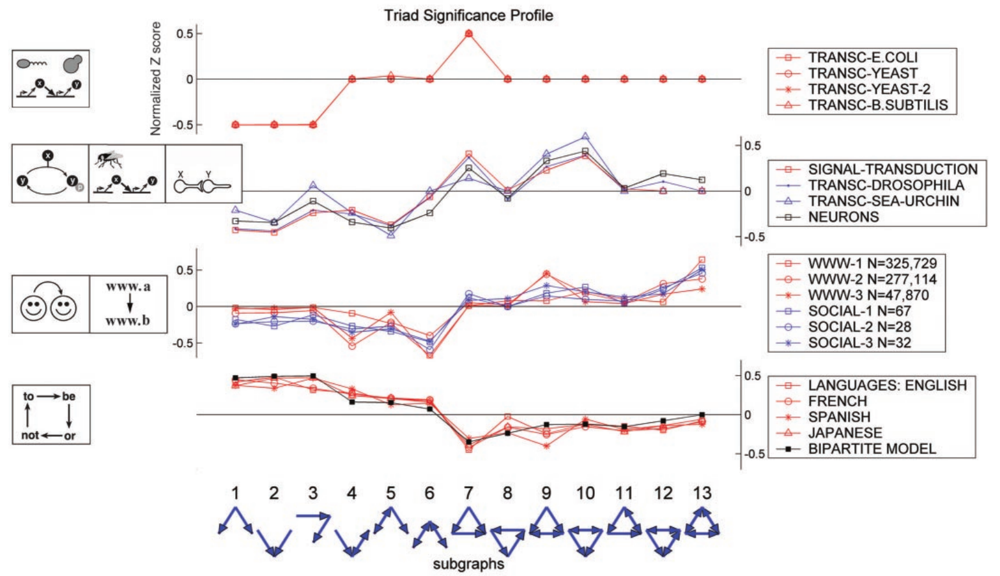
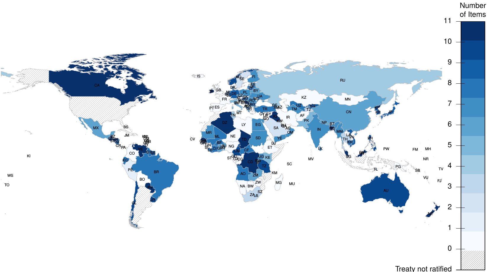
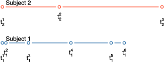
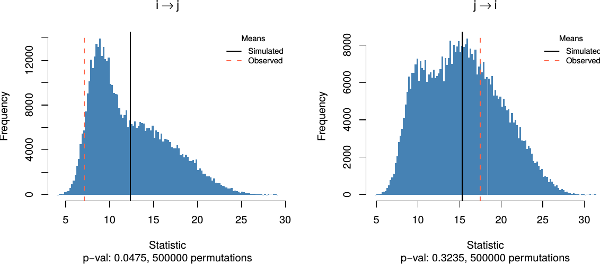
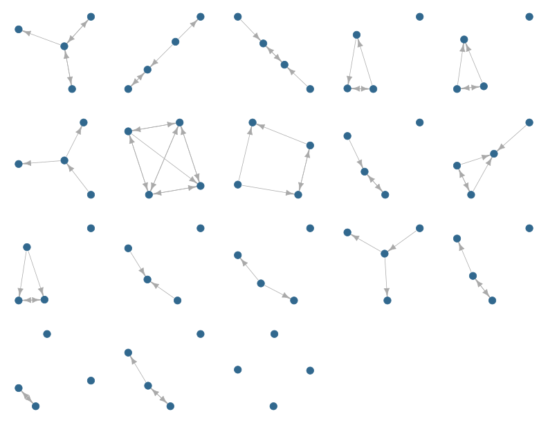
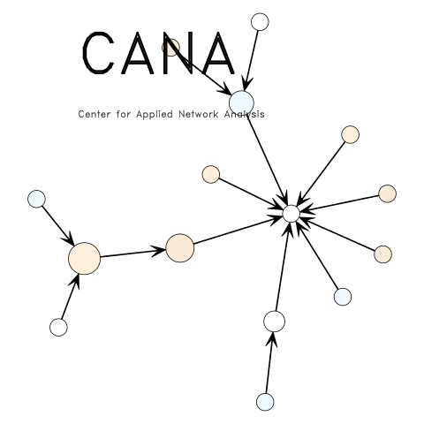

## Que faltó

Hemos revisado algunos de los modelos más importantes, pero aun así nos faltaron
cosas por revisar!


-   GERGM: Generalized Exponential Random Graph Models (using weighted graphs, see @Desmarais2012).

-   SERGMs: **Statistical** Exponential Random Graph Models, suitable for large graphs, uses sufficient statistics.
[see @Chandrasekhar2012]

-   DyNAM: dynamic network actor models [see @Stadtfeld2017].

-   REM: Relational Event Models [see @Butts2008], which are very similar to DyNAMs.

-   ALAAM: Autologistic actor attribute models [see @Daraganova2013;@Kashima2013]

-   Network Matching [@Aral2009]

## Network Motifs

{style="width:900px;"}

Fuente @Milo2004

## WHO Framework Convention on Tobacco Control

Modelo tobit $Y_t =\rho W Y_{t-1} + X\beta + \varepsilon$

{style="width:900px;"}

Fuente: Elaboración Propia

## Social Mimicry: Test de permutación

{style="width:600px;"}

Fuente: Elaboración propia

## Social Mimicry: Test de permutación (cont.)

{style="width:900px;"}

Fuente: Elaboración propia

## Equipos pequeños

{style="width:900px"}

Fuente: Elaboración propia

## {style="text-align:center!important;"}

```{r thanks, out.width="300px", fig.align='center', echo=FALSE}

```

### ¡Gracias!

<p style="text-align:center!important;">
`r icon::fa("github")`  [gvegayon](https://github.com/gvegayon/) <br>
`r icon::fa("twitter")`  [\@gvegayon](https://twitter.com/gvegayon) <br>
`r icon::fa("home")`  [ggvy.cl](https://ggvy.cl)<br><br>
<text style="color:gray;font-size:80%">Presentation created with `r icon::fa("heart")` and [revealjs](https:cran.r-project.org/package=revealjs)</text>
</p>

## Bibliografía {style="font-size:40%"}
